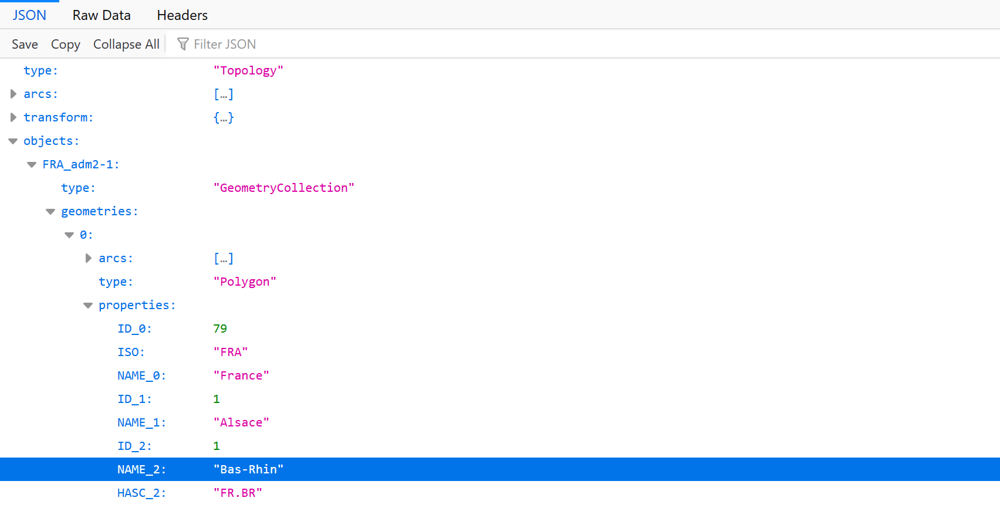

# Visualise results of an election using D3
See [documentation](http://atharvat80.github.io/D3_Assignment/out/index.html) for more information

# Example
- [2017 French presidential election results](http://atharvat80.github.io/D3_Assignment) 

# Tutorial
## Prerequisites 
- [D3](https://d3js.org/) the javascript module and it's following submodules:
    - [D3 Queue](https://github.com/d3/d3-queue#d3-queue) 
    - D3 TopoJSON
    
    *These can be linked directly in the HTML file of your visualisation*

-  A Shapefile of your chosen geographical area (make sure it includes data about the administrative levels you wish to visualise)
- Election results in CSV file format
- Create a JSON file that defines the hex codes of the colour scheme for the visualisation e.g. the file should look like this
    ```
    {
    "party_1": "#ffffff";
    "party_2": "#000000";
    }
    ```

## Creating the visualisation
### Obtaining a TopoJSON file for the visualisation
Convert the shapefile into TopoJSON file format. [Mapshaper](https://mapshaper.org/) is a simple online tool that can be used to convert shapefiles into TopoJSON format
1. Find and upload your shapefile by clicking the select button
1. Click import once the files have been uploaded
1. Wait for the preview to load and click export and make sure to select TopoJSON as the export format  
1. Follow [this](https://www.statsilk.com/maps/simplify-map-reducing-file-size-and-loading-time) article for details on simplifying the shapefile for faster processing

It helps to have basic understanding of the structure of a TopoJSON file as it is required to understand what arguments should be provided while initiating the visualisation, [this](https://www.spotzi.com/en/help-center/what-is-a-topojson/) article can be very useful in understanding that. 

For example, the [departements.json](./france_2017/departements.json) used for the exemplar visualisation is structured like this



```objects:FRA_adm2-1``` contains data about all the french departements in the map and ```properties:NAME_2``` contains the name of of the departement. Therefore, ```"FRA_adm2-1"``` and ```"NAME_2"``` have been passed as arguments while initiating the visualisation so the script can extract relevant data from the TopoJSON file.

*Note: other TopoJSON file have a similar format just with different names for the attributes*

### Create a suitable HTML and CSS file
A very basic template files are included below

#### Sample HTML file
```
<!DOCTYPE html>
<html>
    <head>
        <meta charset="UTF-8">
        <title>Page Title</title>
        <link href="/path/to/stylesheet.css" rel="stylesheet" type="text/css">
    </head>
    
    <body>
        <div id="map"></div>
        <p id="constituency" class="info"></p>
        <p id="result" class="info"></p>

        <script src="https://d3js.org/d3.v4.min.js"></script>
        <script src="https://d3js.org/d3-queue.v3.min.js"></script>
        <script src="https://d3js.org/topojson.v2.min.js"></script>
        <script src="/path/to/script.js"></script>
    </body>

</html> 
```    
Make sure that the HTML file contains two separate elements with ```id="constituency" class="info"``` and ```id="results class="info"``` as they are required to display results of an area when the user clicks on it.

#### Sample CSS file
```
.area {
  stroke: colour;
  stroke-width: width;
  // styling for the path elements that make up the map here
}

.info{
  // styling for the text that displays results here
}
```
Make sure to add classes called ```area``` and ```info``` to you CSS stylesheet as these define the styling for your map and the information that will be displayed
### Editing the script file
1. Create a local copy of the script which can be obtained [here](script.js) and tweak it as such:
1. Create an instance of class ```map``` by adding 
    ```
    var name = new map()
    ```
    Then initiate the instance of ```map``` using the ```map.init()``` method as such:

    ```
    name.init(
        "path/to/TopoJSON_file.json",
        "path/to/election_data.csv",
        "path/to/colourScheme.json", 
        "map",                          /* id of the HTML tag the visualisation should be displayed in
                                        "map" refers to the <div id="map"><div> element in the example HTML file */
        "FRA_adm2-1",                   // See "Obtaining a TopoJSON file for the visualisation" section of the tutorial
        "NAME_2",                       // See "Obtaining a TopoJSON file for the visualisation" section of the tutorial
        "constituency",                 // Name of the column that contains name of the administrative levels of your data set
        "candidate",                    // Name of the column that contains the name of the candidate
        "party",                        // Name of the column that contains the name of the party of the candidate
        scale                           // optional, 0.98 by default in not provided.
    );
    ```